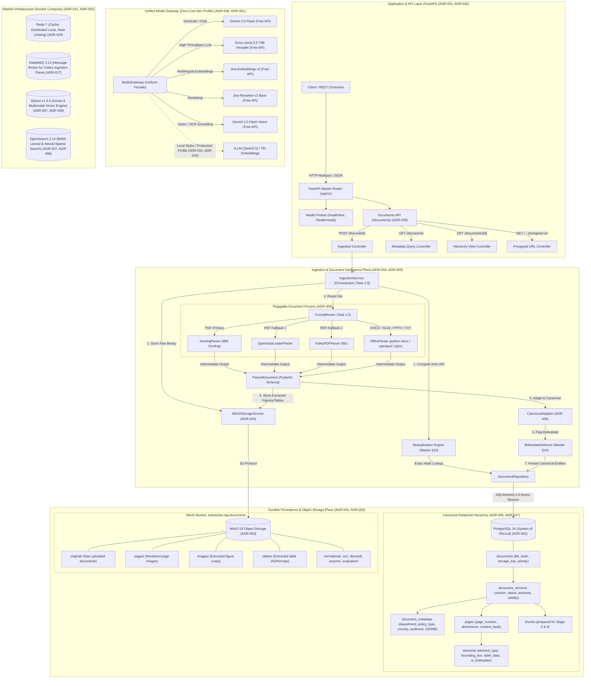

# Enterprise Multimodal RAG Platform — Current Architecture & Technology Baseline

> **Current Implementation State:** Completed through **Stage 0 (Foundations & Model Gateway)**, **Stage 1 (Document Intelligence & Parsers)**, and **Stage 2 (Canonical Model, Persistence & Object Storage)**.

---

## 1. System Architecture Diagram (Current State)

---

## 2. Implemented Components & Technologies Overview

| Subsystem / Component | Technologies & Libraries | Current Status | Key Architectural Decision (ADR) |
| :--- | :--- | :---: | :--- |
| **API & Application Framework** | FastAPI 0.111+, Uvicorn, Pydantic v2, Pydantic-Settings, Structlog | **Active** | [ADR-001](file:///d:/Projects%20&%20Certificates/Projects/Enterprise-RAG-Platform/docs/architecture/ADR-001-fastapi.md), [ADR-030](file:///d:/Projects%20&%20Certificates/Projects/Enterprise-RAG-Platform/docs/architecture/ADR-030-api-architecture.md), [ADR-035](file:///d:/Projects%20&%20Certificates/Projects/Enterprise-RAG-Platform/docs/architecture/ADR-035-api-contracts.md) |
| **Model Gateway (Inference Layer)** | Google GenAI SDK, Groq SDK, Jina AI (HTTP), Tenacity | **Active** | [ADR-046](file:///d:/Projects%20&%20Certificates/Projects/Enterprise-RAG-Platform/docs/architecture/ADR-046-model-gateway.md), [ADR-051](file:///d:/Projects%20&%20Certificates/Projects/Enterprise-RAG-Platform/docs/architecture/ADR-051-dev-inference-profile.md) |
| **Document Intelligence & Parsers** | IBM Docling, OpenDataLoader PDF, PyMuPDF (fitz), python-docx, openpyxl, python-pptx | **Active** | [ADR-004](file:///d:/Projects%20&%20Certificates/Projects/Enterprise-RAG-Platform/docs/architecture/ADR-004-document-intelligence.md) |
| **Canonical Document Model** | SQLAlchemy 2.0 (DeclarativeBase, AsyncSession), Pydantic v2 | **Active** | [ADR-005](file:///d:/Projects%20&%20Certificates/Projects/Enterprise-RAG-Platform/docs/architecture/ADR-005-canonical-document-model.md), [ADR-037](file:///d:/Projects%20&%20Certificates/Projects/Enterprise-RAG-Platform/docs/architecture/ADR-037-document-versioning.md) |
| **Primary Database (System of Record)** | PostgreSQL 16 Alpine, asyncpg, aiosqlite (for unit tests) | **Active** | [ADR-002](file:///d:/Projects%20&%20Certificates/Projects/Enterprise-RAG-Platform/docs/architecture/ADR-002-postgresql.md) |
| **Database Migrations** | Alembic 1.13+, Mako | **Active** | [ADR-034](file:///d:/Projects%20&%20Certificates/Projects/Enterprise-RAG-Platform/docs/architecture/ADR-034-schema-migrations.md) |
| **Object Storage Abstraction** | MinIO Python SDK (S3-compatible API) | **Active** | [ADR-003](file:///d:/Projects%20&%20Certificates/Projects/Enterprise-RAG-Platform/docs/architecture/ADR-003-object-storage.md) |
| **Deduplication & Boilerplate Engine** | SHA-256 Hashing, 64-bit SimHash, Regex & Layout Heuristics | **Active** | [Master Plan §10](file:///d:/Projects%20&%20Certificates/Projects/Enterprise-RAG-Platform/docs/production_grade_multimodal_rag_master_plan.md#L419-L463) |
| **Synchronous Ingestion Pipeline** | Modular IngestionService, FastAPI Dependency Injection | **Active** | [ADR-036](file:///d:/Projects%20&%20Certificates/Projects/Enterprise-RAG-Platform/docs/architecture/ADR-036-idempotency.md) |
| **Containerized Infrastructure** | Docker, Docker Compose (Postgres, Redis, RabbitMQ, MinIO, Qdrant, OpenSearch) | **Provisioned** | [ADR-031](file:///d:/Projects%20&%20Certificates/Projects/Enterprise-RAG-Platform/docs/architecture/ADR-031-containerization.md), [ADR-052](file:///d:/Projects%20&%20Certificates/Projects/Enterprise-RAG-Platform/docs/architecture/ADR-052-infrastructure-profile.md) |
| **Testing & Quality Assurance** | Pytest 8.2+, Pytest-Asyncio, Ruff 0.4+, Mypy 1.10+ (42 passed tests) | **Active** | [ADR-028](file:///d:/Projects%20&%20Certificates/Projects/Enterprise-RAG-Platform/docs/architecture/ADR-028-evaluation-metrics.md), [ADR-029](file:///d:/Projects%20&%20Certificates/Projects/Enterprise-RAG-Platform/docs/architecture/ADR-029-evaluation-framework.md) |

---

## 3. Technology Rationale — Why Each Technology is Used

### 1. FastAPI + Pydantic v2 ([ADR-001](file:///d:/Projects%20&%20Certificates/Projects/Enterprise-RAG-Platform/docs/architecture/ADR-001-fastapi.md), [ADR-030](file:///d:/Projects%20&%20Certificates/Projects/Enterprise-RAG-Platform/docs/architecture/ADR-030-api-architecture.md))
- **Why Chosen:** Native asynchronous runtime (`asyncio`), high-performance validation and serialization through Rust-backed Pydantic v2 core, automatic OpenAPI/Swagger generation, and built-in dependency injection for database sessions and storage clients.
- **Problem Solved:** Enables high-concurrency ingestion and low-latency retrieval streaming without thread pool exhaustion.

### 2. Unified Model Gateway with Free-Tier Dev Profile ([ADR-046](file:///d:/Projects%20&%20Certificates/Projects/Enterprise-RAG-Platform/docs/architecture/ADR-046-model-gateway.md), [ADR-051](file:///d:/Projects%20&%20Certificates/Projects/Enterprise-RAG-Platform/docs/architecture/ADR-051-dev-inference-profile.md))
- **Why Chosen:** A uniform facade isolating inference calls behind capability protocols (`generate`, `embed`, `rerank`, `vision`).
  - **Gemini 2.0 Flash:** Free high-capability multimodal inference (LLM + visual diagram/chart understanding).
  - **Groq Llama 3.3 70B:** Ultra-low-latency generation on specialized LPUs.
  - **Jina Embeddings v3 & Reranker v2:** Multilingual, 8192-token context dense embeddings and cross-encoder reranking with zero infrastructure spend during development.
  - **Local Stubs (vLLM / TEI):** Direct swap-in for on-premises air-gapped deployments without altering business logic.
- **Problem Solved:** Eliminates model lock-in, ensures zero API cost during development, and enforces strict architecture boundaries with AST-verified SDK isolation.

### 3. IBM Docling as Primary Document Parser + Resilient Router ([ADR-004](file:///d:/Projects%20&%20Certificates/Projects/Enterprise-RAG-Platform/docs/architecture/ADR-004-document-intelligence.md))
- **Why Chosen:** IBM Docling excels at structural layout understanding, reading-order reconstruction, and complex table structure recovery into clean Markdown/JSON.
  - **OpenDataLoader & PyMuPDF Fallbacks:** If Docling encounters corrupted fonts or unusual PDF structures, `FormatRouter` automatically degrades through OpenDataLoader and PyMuPDF without dropping the document.
  - **Native Office Parsers:** `python-docx`, `openpyxl`, and `python-pptx` provide lossless structural extraction for DOCX, XLSX, and PPTX.
- **Problem Solved:** Retrieval quality is fundamentally bounded by parsing quality. Docling prevents broken table cells and jumbled multi-column reading orders from contaminating downstream chunks.

### 4. Canonical Document Model ([ADR-005](file:///d:/Projects%20&%20Certificates/Projects/Enterprise-RAG-Platform/docs/architecture/ADR-005-canonical-document-model.md))
- **Why Chosen:** A custom internal hierarchy (`Document -> DocumentVersion -> Page -> Element`):
  - Every element carries its physical coordinates (`bounding_box`), parent heading ID, content hash, reading sequence index, and structured table data.
  - Document versioning tracks document lifecycle (`draft`, `active`, `superseded`, `archived`) and validity timestamps ([ADR-037](file:///d:/Projects%20&%20Certificates/Projects/Enterprise-RAG-Platform/docs/architecture/ADR-037-document-versioning.md)).
  - Enterprise HR metadata captures `department`, `policy_type`, `country`, `location`, `employee_type`, `grade`, `confidentiality`, `audience` ([Master Plan §13](file:///d:/Projects%20&%20Certificates/Projects/Enterprise-RAG-Platform/docs/production_grade_multimodal_rag_master_plan.md#L528-L566)).
- **Problem Solved:** Decouples the entire platform from any specific parser schema. Allows parsers to be swapped or upgraded without rebuilding downstream retrieval, citation, or evaluation pipelines.

### 5. PostgreSQL 16 + AsyncPG ([ADR-002](file:///d:/Projects%20&%20Certificates/Projects/Enterprise-RAG-Platform/docs/architecture/ADR-002-postgresql.md))
- **Why Chosen:** ACID-compliant relational system of record for all persistent document structures, version histories, ACL permissions, ingestion logs, and evaluation runs.
- **Problem Solved:** Vector databases and search engines are treated as derived search indexes; PostgreSQL guarantees ground-truth data consistency and transactional integrity.

### 6. MinIO S3-Compatible Object Storage ([ADR-003](file:///d:/Projects%20&%20Certificates/Projects/Enterprise-RAG-Platform/docs/architecture/ADR-003-object-storage.md))
- **Why Chosen:** S3-compatible, high-performance object store enforcing content-addressed storage keys and a strict prefix hierarchy (`original/`, `pages/`, `images/`, `tables/`, `derived/`, `evaluation/`).
- **Rule Enforced:** Source files, rendered page PNGs, and cropped figures are never stored in PostgreSQL blobs; PostgreSQL holds only the metadata and storage keys.
- **Problem Solved:** Keeps the database lean and fast while allowing secure, time-limited document access via presigned URLs.

### 7. Deduplication & Boilerplate Detection Engine ([Master Plan §10](file:///d:/Projects%20&%20Certificates/Projects/Enterprise-RAG-Platform/docs/production_grade_multimodal_rag_master_plan.md#L419-L463))
- **Why Chosen:** Multi-stage deduplication:
  - **Exact File Deduplication:** Computes SHA-256 before parsing; re-uploading an identical document instantly short-circuits and returns existing IDs ([ADR-036](file:///d:/Projects%20&%20Certificates/Projects/Enterprise-RAG-Platform/docs/architecture/ADR-036-idempotency.md)).
  - **SimHash Near-Duplicate Detection:** 64-bit fingerprinting identifies near-duplicate policies and clusters them under a shared `duplicate_group_id`.
  - **BoilerplateDetector:** Detects recurring headers, footers, page numbering ("Page X of Y"), and legal notices across multi-page documents and flags them (`is_boilerplate=True`).
- **Problem Solved:** Prevents repetitive header/footer noise from diluting vector search relevance while preserving visual coordinates for exact bounding-box citations.

### 8. Alembic Database Migrations ([ADR-034](file:///d:/Projects%20&%20Certificates/Projects/Enterprise-RAG-Platform/docs/architecture/ADR-034-schema-migrations.md))
- **Why Chosen:** Version-controlled database schema evolution configured to run against async SQLAlchemy engines.
- **Problem Solved:** Guarantees repeatable, automated schema deployments across development, staging, and production without manual SQL intervention.

---

## 4. Key Source Code References

- **Application Factory & Probes:** [`app/main.py`](file:///d:/Projects%20&%20Certificates/Projects/Enterprise-RAG-Platform/app/main.py), [`app/api/v1/health.py`](file:///d:/Projects%20&%20Certificates/Projects/Enterprise-RAG-Platform/app/api/v1/health.py)
- **Model Gateway:** [`app/models/gateway.py`](file:///d:/Projects%20&%20Certificates/Projects/Enterprise-RAG-Platform/app/models/gateway.py), [`app/models/providers/`](file:///d:/Projects%20&%20Certificates/Projects/Enterprise-RAG-Platform/app/models/providers/)
- **Document Parsers & Router:** [`app/ingestion/parsers/router.py`](file:///d:/Projects%20&%20Certificates/Projects/Enterprise-RAG-Platform/app/ingestion/parsers/router.py), [`app/ingestion/parsers/base.py`](file:///d:/Projects%20&%20Certificates/Projects/Enterprise-RAG-Platform/app/ingestion/parsers/base.py)
- **Canonical ORM Models:** [`app/db/models/`](file:///d:/Projects%20&%20Certificates/Projects/Enterprise-RAG-Platform/app/db/models/) (`document.py`, `version.py`, `metadata.py`, `page.py`, `element.py`, `chunk.py`)
- **Async Database Session & Repositories:** [`app/db/session.py`](file:///d:/Projects%20&%20Certificates/Projects/Enterprise-RAG-Platform/app/db/session.py), [`app/db/repositories/document_repo.py`](file:///d:/Projects%20&%20Certificates/Projects/Enterprise-RAG-Platform/app/db/repositories/document_repo.py)
- **Object Storage Service:** [`app/storage/base.py`](file:///d:/Projects%20&%20Certificates/Projects/Enterprise-RAG-Platform/app/storage/base.py), [`app/storage/minio_service.py`](file:///d:/Projects%20&%20Certificates/Projects/Enterprise-RAG-Platform/app/storage/minio_service.py)
- **Adapters & Ingestion Pipeline:** [`app/ingestion/adapters/canonical_adapter.py`](file:///d:/Projects%20&%20Certificates/Projects/Enterprise-RAG-Platform/app/ingestion/adapters/canonical_adapter.py), [`app/ingestion/dedup.py`](file:///d:/Projects%20&%20Certificates/Projects/Enterprise-RAG-Platform/app/ingestion/dedup.py), [`app/ingestion/service.py`](file:///d:/Projects%20&%20Certificates/Projects/Enterprise-RAG-Platform/app/ingestion/service.py)
- **Documents REST API:** [`app/api/v1/documents.py`](file:///d:/Projects%20&%20Certificates/Projects/Enterprise-RAG-Platform/app/api/v1/documents.py), [`app/api/v1/schemas/documents.py`](file:///d:/Projects%20&%20Certificates/Projects/Enterprise-RAG-Platform/app/api/v1/schemas/documents.py)
- **Alembic Migrations:** [`alembic.ini`](file:///d:/Projects%20&%20Certificates/Projects/Enterprise-RAG-Platform/alembic.ini), [`alembic/versions/0001_initial_schema.py`](file:///d:/Projects%20&%20Certificates/Projects/Enterprise-RAG-Platform/alembic/versions/0001_initial_schema.py)
- **Docker Compose Infrastructure:** [`docker-compose.yml`](file:///d:/Projects%20&%20Certificates/Projects/Enterprise-RAG-Platform/docker-compose.yml)
