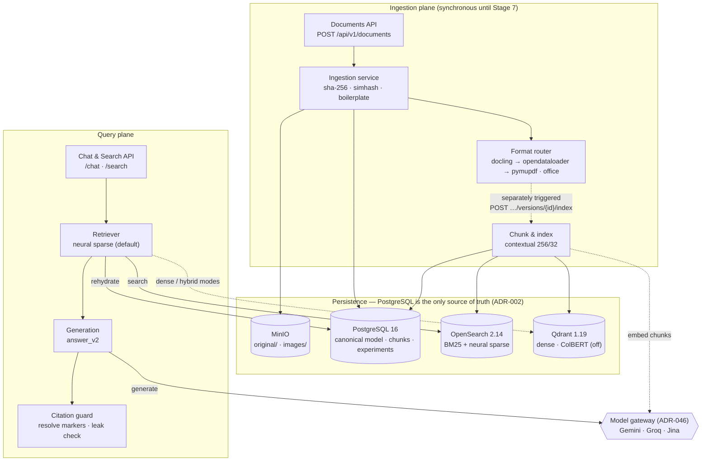
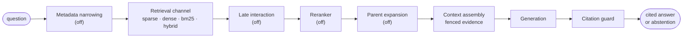

# Enterprise Multimodal RAG Platform — Architecture

**Implemented through Stage 6** (hybrid retrieval, fusion & reranking) of the
15-stage roadmap. Stage 7 — the async Celery ingestion plane — is next.

An HR policy assistant built as a production-grade RAG platform: every answer is
grounded in retrieved evidence, every citation is checked against what the model
was actually given, and every configuration choice is made by a measured
experiment rather than by preference.

Rendered diagrams: [`docs/diagrams/architecture-current-state.html`](docs/diagrams/architecture-current-state.html).
Progress and module map: [`docs/roadmap/CURRENT_STATE.md`](docs/roadmap/CURRENT_STATE.md).
Stage records: `docs/STAGE_3_THIN_RAG.md`, `docs/STAGE_4_EVALUATION.md`,
`docs/STAGE_5_6_CHUNKING_AND_RETRIEVAL.md`.

---

## 1. System overview


```mermaid
flowchart TB
    subgraph Ingestion["Ingestion plane (synchronous until Stage 7)"]
        DocsAPI["Documents API<br/>POST /api/v1/documents"] --> Ingest["Ingestion service<br/>sha-256 · simhash · boilerplate"]
        Ingest --> Router["Format router<br/>docling → opendataloader → pymupdf · office"]
        Router -. "separately triggered<br/>POST …/versions/{id}/index" .-> Index["Chunk & index<br/>contextual 256/32"]
    end

    subgraph Stores["Persistence — PostgreSQL is the only source of truth (ADR-002)"]
        MinIO[("MinIO<br/>original/ · images/")]
        PG[("PostgreSQL 16<br/>canonical model · chunks · experiments")]
        OS[("OpenSearch 2.14<br/>BM25 + neural sparse")]
        QD[("Qdrant 1.19<br/>dense · ColBERT (off)")]
    end

    subgraph Query["Query plane"]
        ChatAPI["Chat & Search API<br/>/chat · /search"] --> Retriever["Retriever<br/>neural sparse (default)"]
        Retriever --> Gen["Generation<br/>answer_v2"]
        Gen --> Guard["Citation guard<br/>resolve markers · leak check"]
    end

    Gateway{{"Model gateway (ADR-046)<br/>Gemini · Groq · Jina"}}

    Ingest --> MinIO
    Ingest --> PG
    Index --> PG
    Index --> OS
    Index --> QD
    Index -. "embed chunks" .-> Gateway
    Retriever -- "search" --> OS
    Retriever -- "rehydrate" --> PG
    Retriever -. "dense / hybrid modes" .-> QD
    Gen -- "generate" --> Gateway
```

Two properties hold everywhere:

* **Derived indexes, one source of truth.** Qdrant and OpenSearch are rebuilt
  from PostgreSQL and keyed on deterministic chunk IDs (ADR-002, ADR-036); every
  retrieval channel rehydrates its hits from PostgreSQL before they reach a prompt.
* **Model access goes through one gateway.** Retrieval, generation and evaluation
  call `generate`, `embed`, `embed_multivector` and `rerank`; which provider serves
  them is a configuration profile (`hosted`, `local`, `stub`), enforced by a lint
  rule that forbids provider SDK imports outside `app/models/providers/`.

---

## 2. The query path


```mermaid
flowchart LR
    Q(["question"]) --> N["Metadata narrowing<br/>(off)"]
    N --> C["Retrieval channel<br/>sparse · dense · bm25 · hybrid"]
    C --> L["Late interaction<br/>(off)"]
    L --> R["Reranker<br/>(off)"]
    R --> P["Parent expansion<br/>(off)"]
    P --> A["Context assembly<br/>fenced evidence"]
    A --> G["Generation"]
    G --> V["Citation guard"]
    V --> Out(["cited answer<br/>or abstention"])
```

Each stage wraps the same `Retriever` contract (`app/retrieval/channels.py`), so
each is one setting away, and each writes a trace into the result's
`retrieval_config`. The optional stages were all built and measured in Stage 6;
they are off because none beat plain neural sparse by a margin the evidence could
resolve.

| Stage | Setting | Default | What it does |
|---|---|---|---|
| Metadata narrowing | `ENABLE_METADATA_NARROWING` | off | Infers department / policy type / employee type from the question and pushes them into the engine's filter |
| Retrieval channel | `RETRIEVAL_MODE` | **`sparse`** | `sparse` (OpenSearch neural sparse), `dense` (Qdrant), `bm25`, or `hybrid` (RRF over all three) |
| Late interaction | `ENABLE_LATE_INTERACTION` | off | ColBERT MaxSim over the candidate pool, scored inside Qdrant |
| Reranker | `ENABLE_RERANKING` | off | Jina cross-encoder, pool of 20 → top 8 |
| Parent expansion | `ENABLE_PARENT_EXPANSION` | off | Leaf chunk → its section, token-budgeted (needs `hierarchical_contextual` chunks) |
| Answer prompt | `PROMPT_VERSION_ANSWER` | `answer_v2` | Grounding rules plus refusal rules for context dumps and invented policy |

The citation guard rejects any answer whose citations do not resolve to the
evidence the model was given, and any answer that reproduces its own evidence
fences or instructions.

---

## 3. Evaluation

Offline, and the reason every default above is what it is.

* **Golden dataset** — 181 questions over the real corpus in `dev` / `validation`
  / locked `test` splits, ten question types including adversarial and unsupported.
* **Layer 0** retrieval metrics (recall@k, nDCG, MRR, context recall), **Layer 1**
  deterministic answer checks (citation integrity, exact match, abstention),
  **Layer 2** an LLM judge on a different model from the generator.
* **Experiment runner** — checkpointed and resumable across free-tier quota
  windows; provider refusals and outages are retried, not recorded as failures.
* **Regression gate** in CI compares the newest committed experiment with the
  baseline and fails on a drop beyond tolerance.

Records live in `evaluation/results/`; `python -m app.evaluation.cli diff` compares two.

---

## 4. Technology and why

| Area | Technology | Decision |
|---|---|---|
| API | FastAPI, Pydantic v2, structlog | ADR-001, ADR-030 |
| Source of truth | PostgreSQL 16, SQLAlchemy 2 async, Alembic (4 migrations) | ADR-002, ADR-034 |
| Object storage | MinIO (S3 API) | ADR-003 |
| Parsing | IBM Docling primary; OpenDataLoader, PyMuPDF fallbacks; python-docx / openpyxl / python-pptx | ADR-004 |
| Canonical model | Document → Version → Page → Element, with bounding boxes and HR metadata | ADR-005, ADR-037 |
| Chunking | `contextual` 256/32 — document and section prefixed to every chunk | ADR-006 |
| Lexical + neural sparse | OpenSearch 2.14 — BM25 with prose and exact-code analyzers; `opensearch-neural-sparse-encoding-doc-v2-distill` in doc-only mode | ADR-007, ADR-008 |
| Dense + late interaction | Qdrant 1.19 — `jina-embeddings-v3`; `jina-colbert-v2` multivectors (off) | ADR-009, ADR-012 |
| Fusion / reranking | RRF or weighted fusion; `jina-reranker-v2-base-multilingual` | ADR-011, ADR-013 |
| Generation | Gemini (`gemini-3.6-flash`) primary, Groq (`openai/gpt-oss-120b`) fallback, via the gateway | ADR-046, ADR-051 |
| Infrastructure | Docker Compose: PostgreSQL, Qdrant, OpenSearch, MinIO, Redis, RabbitMQ | ADR-031, ADR-052 |

Why these, briefly:

* **Parsing quality bounds retrieval quality.** Docling recovers reading order and
  tables; the router degrades through fallback parsers rather than dropping a file.
* **The canonical model decouples everything downstream from the parser.** Parsers
  can change without rebuilding retrieval, citations or evaluation.
* **Neural sparse is the default channel because it measured best per second.**
  Dense-only was significantly the worst channel on both dev and held-out splits;
  sparse tied the reranked paths on held-out quality at 0.13 s retrieval (p50), and in a
  paired end-to-end run answered 76 of 82 answerable questions against dense's 55.
  The trade accepted: it has no fallback channel, so readiness requires OpenSearch
  and loaded sparse models in this mode.
* **Free-tier hosted inference in development, swappable by profile.** The `local`
  profile targets vLLM and TEI for deployments where corpus text must not leave
  the network (ADR-045).

---

## 5. Operating it

```text
make up                                        # services
make migrate                                   # schema
python -m scripts.ingest_corpus                # parse, chunk, index the benchmark corpus
python -m scripts.setup_neural_sparse          # sparse models, pipeline, index (once per OpenSearch volume)
python -m scripts.index_lexical [--sparse]     # backfill BM25 / neural sparse from PostgreSQL
python -m scripts.apply_corpus_metadata        # curated HR metadata -> PostgreSQL + every index
make verify                                    # lint + typecheck + tests
```

Readiness (`GET /api/v1/health/ready`) requires PostgreSQL, Qdrant and MinIO, plus
OpenSearch and loaded sparse models when `RETRIEVAL_MODE` is `sparse`: after an
OpenSearch restart the cluster reports green minutes before its models reload.

---

## 6. Where things live

| Path | Contents |
|---|---|
| `app/api/v1/` | `/documents`, `/chat`, `/search`, `/health`, `/admin/status`, `/evaluation/runs` |
| `app/ingestion/` | parsers and router, canonical adapter, dedup and boilerplate, chunking strategies |
| `app/retrieval/` | channels (`dense`, `lexical`, `sparse`), `fusion`, `narrowing`, `reranking`, `late_interaction`, `expansion`, indexers, stores, `metadata_sync` |
| `app/generation/` | context assembly, versioned prompts, citation validation and leak guard |
| `app/evaluation/` | dataset, metrics, judge, runner, diff and gate, CLI |
| `app/models/` | the model gateway and its providers |
| `app/core/` | configuration, logging, health probes |
| `evaluation/` | golden dataset splits and committed experiment records |
| `scripts/` | corpus ingestion, index backfills, sparse setup, metadata, chunking sweep |
